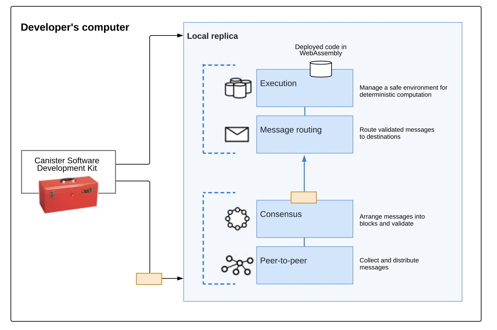

# 2.节点和子网络

IC 子网提供软件运行所需要的物理硬件和资源，比如 CPU和内存。每个子网由一组点对点连接，称之为Node的独立机器组成。节点上运行遵循IC协议的软件。

运行在节点上的IC软件，称之为replica，因为他们在子网中的各个节点上都有副本。

replica的核心组件由以下逻辑层组成：

* 点对点网络层：收集传播子网中以及子网间用户和节点的通信消息。该层收到的消息会复 制到子网中的所有节点，以确保平台的安全、可靠与弹性。
* 共识层：选择并序列化来自用户和其他子网的消息，形成输入块，在发送到路由层之前进 行最终证实确认。
* 消息路由层：转发不同子网间用户和系统产生的消息，与应用建立消息的输入输出队列， 调度消息的执行。
* 执行环境：执行程序、处理来自路由层的消息，保证计算的确定性。

下图展示了IC协议组件的整体结构。这些组件部署在本地开发环境的replica中：

作为开发者，并不需要知道用户通过IC架构与你的应用交互的细节。不过，对一些核心组件的基础知识，有助于你理解本地开发环境和生产环境的工作流。

