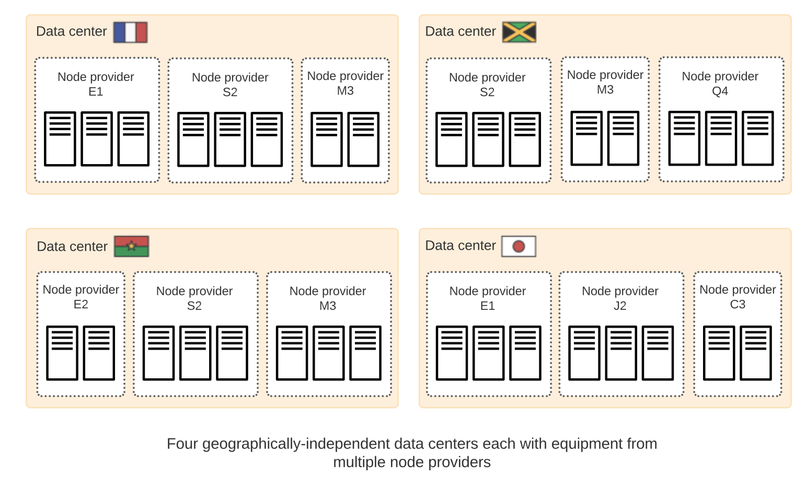

# 3.分布式数据中心

IC并不是实体硬件。相反的，IC是由全球独立运营的数据中心提供的计算资源组成的。

不像公有云、私有云，IC并不是由单独一家私人公司运营。相反，IC是一个由算法、分布式治理协议所管理的公共计算设施。其架构可以让多个计算机组成一个强大的虚拟机。

组成这个虚拟机的计算机分成分布在全球的多个子网数据中心。分布式架构上的安全通信不需要借助防火墙和防攻击技术。独立数据中心提供商通过贡献计算资源、运行应用服务，从而得到相应奖励。

#### 子网与数据中心

这种完全的分布式网络，可以支持颠覆性的服务。组成任何子网的物理节点分布在多个地点。这些节点本身可能属于不同的地方的数据中心。

下图展示了分布在四个数据中心的子网

在这个简图中：

- 有四个独立的数据中心

- 每个数据中心的硬件由多个节点提供商提供

- 任何一个节点提供商可能在多个数据中心都有设

尽管这个例子中展示了一个子网的节点分布在多个数据中心，其实如果需要，任何节点都可以从这个子网中挪出来，形成新的子网。网络拓扑变更由IC治理系统中的网络神经系统（Network Nervous System, MNS）管理。

#### 节点提供商和数据中心运营商

在大多数情况下，节点提供商，或者由节点提供商和数据中心运营商共同负责监控、维护计算资源。比如说，节点提供商和数据中心运营商可能需要修复或者替换有故障的和性能不够的设备。而网络的运营和升级则是由分布式治理系统MNS监控管理。

#### 了解更多？

如果你要了解更多关于数据中心运营和节点提供商，请查阅以下信息：

IC节点提供商关于数据中心的帮助（FAQ、文章）。

